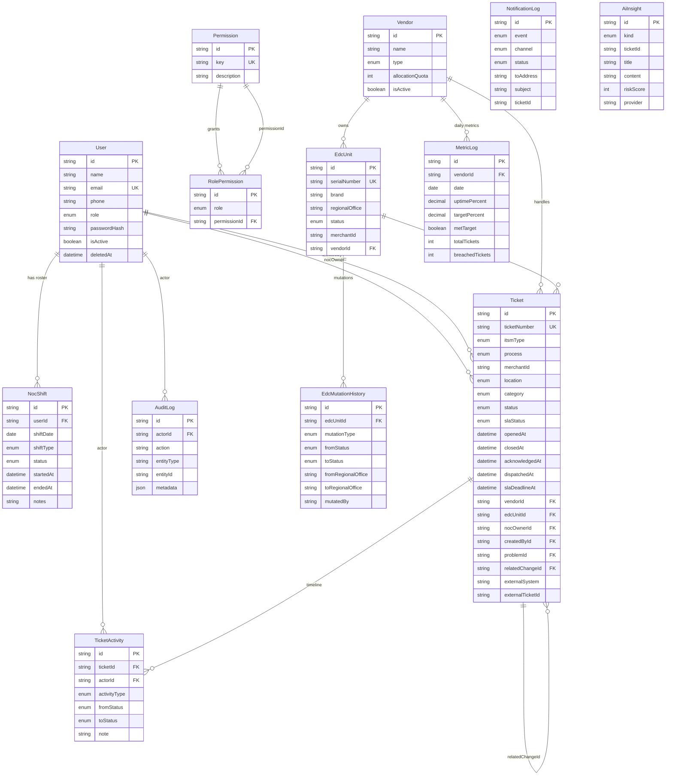
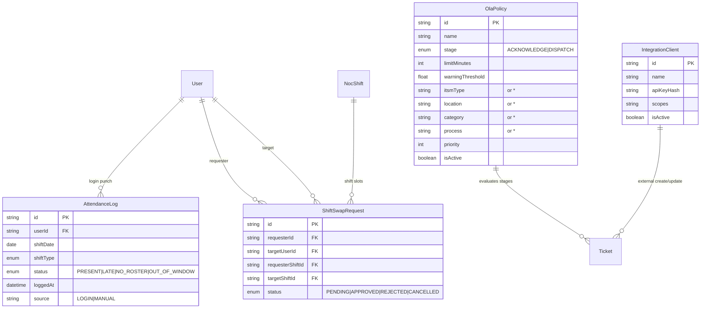
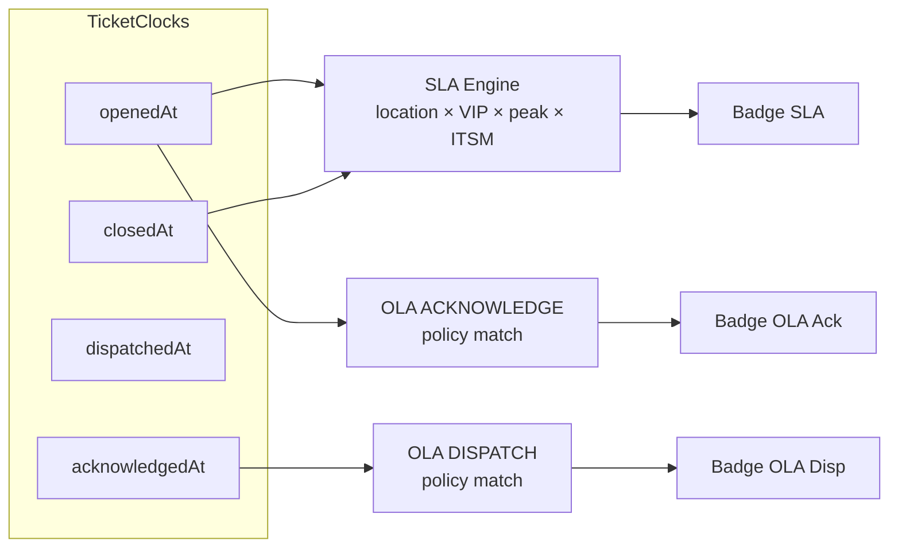

# EDC Manager — Entity Relationship Diagram (ERD)

Diagram berbasis `prisma/schema.prisma` (sumber kebenaran untuk PostgreSQL produksi), ditambah catatan entitas runtime demo yang belum sepenuhnya di-persist.

Dokumentasi terkait: [Manual Guide](./MANUAL.md) · [README](../README.md)

---

## 1. Ringkasan domain

```text
User / RBAC ──► Ticket lifecycle + Activity
     │                │
     ├── NocShift     ├── Vendor ◄── MetricLog
     │                └── EdcUnit ◄── MutationHistory
     │
NotificationLog / AiInsight (advisory)
```

**SLA** dihitung dari Ticket (`location`, `category`, `openedAt`, `closedAt`, `itsmType`).  
**OLA** (runtime) memakai `acknowledgedAt` / `dispatchedAt` + policy match (lihat §4).

---

## 2. ERD inti (Prisma)



---

## 3. Relasi kunci

| Dari | Ke | Kardinalitas | Catatan |
|------|-----|--------------|---------|
| `User` | `NocShift` | 1:N | Unique `(userId, shiftDate, shiftType)` |
| `User` | `Ticket` | 1:N | Sebagai `nocOwner` atau `createdBy` |
| `Vendor` | `EdcUnit` | 1:N | Unit EDC milik vendor |
| `Vendor` | `Ticket` | 1:N | Vendor penangan tiket |
| `Vendor` | `MetricLog` | 1:N | Unique `(vendorId, date)` — target uptime 99.9% |
| `EdcUnit` | `EdcMutationHistory` | 1:N | Deploy / recall / transfer / pooling |
| `Ticket` | `TicketActivity` | 1:N | Timeline immutable |
| `Ticket` | `Ticket` | 1:N | Incident → Problem (`problemId`) |
| `Ticket` | `Ticket` | 1:N | Link ke Change (`relatedChangeId`) |
| `Permission` | `RolePermission` | 1:N | RBAC role ↔ permission key |

### Enum penting

- **TicketLocation:** `DALAM_KOTA` · `LUAR_KOTA` · `LUAR_PULAU`
- **TicketCategory:** `VIP` · `NON_VIP`
- **ItsmType:** `INCIDENT` · `REQUEST` · `PROBLEM` · `CHANGE`
- **TicketStatus:** `OPEN` → `ACKNOWLEDGED` → `DISPATCHED` → `IN_PROGRESS` → `RESOLVED` → `CLOSED`
- **SlaStatus:** `ON_TRACK` · `WARNING` · `ACHIEVED` · `BREACHED`
- **EdcUnitStatus:** `BUFFER` · `DEPLOYED` · `IDLE`
- **UserRole:** `ADMIN` · `NOC` · `SUPERVISOR` · `VENDOR_TECH` · `OPS_MANAGER`

---

## 4. Entitas runtime / rencana (belum penuh di Prisma)

Digunakan di UI/API demo (in-memory). Direkomendasikan dipromosikan ke Prisma pada fase DB production.



| Entitas | Store demo | Kegunaan |
|---------|------------|----------|
| `OlaPolicy` | `ola-store` | Jam internal Ack/Dispatch |
| `AttendanceLog` | `wfm-store` | Absensi login L1 |
| `ShiftSwapRequest` | `wfm-store` | Tukar shift + approval |
| `IntegrationClient` | `integration-clients-store` | API key eksternal |
| Connector settings | `connector-settings-store` | SMTP / AI runtime override |

---

## 5. Alur data SLA vs OLA



- **SLA** = kewajiban kontrak ke bank/merchant (penalty-critical).  
- **OLA** = jam kerja internal tim (NOC ack, vendor dispatch) — terpisah dari SLA.

---

## 6. Buffer stock (logika agregat)

Buffer dihitung dari agregasi `EdcUnit` per `regionalOffice`:

\[
\text{buffer\%} = \frac{\text{count(status=BUFFER)}}{\text{total units di RO}} \times 100
\]

Ambang aman: **≥ 10%** (`BUFFER_STOCK_MIN_PERCENT`). Mutasi tercatat di `EdcMutationHistory`.

---

## 7. Cara regenerate / validasi schema

```bash
npm run db:validate
npm run db:generate
npm run db:push      # dev — sinkron schema ke Postgres
```

Sumber: `prisma/schema.prisma`.
