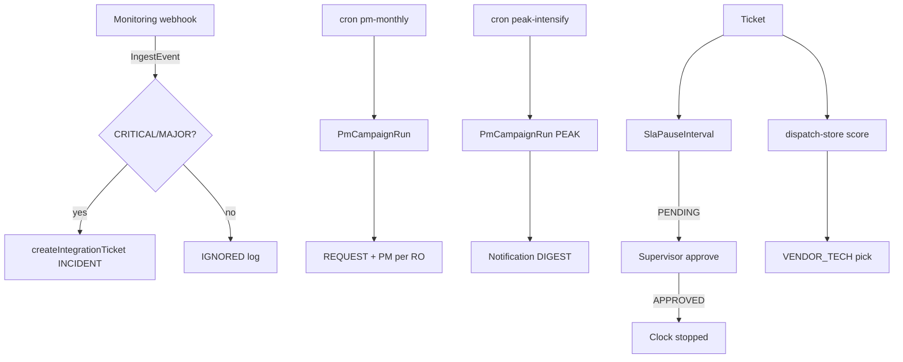
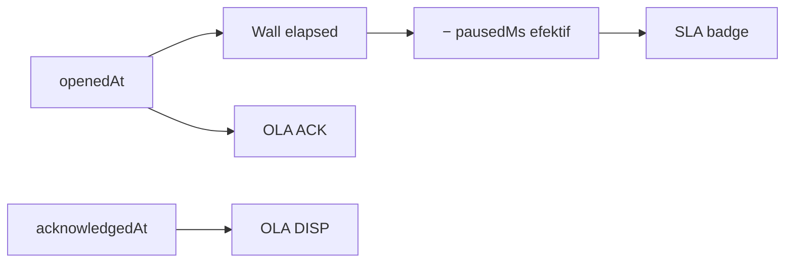

# EDC Manager — Entity Relationship Diagram (ERD)

Sumber kebenaran: `prisma/schema.prisma` (PostgreSQL produksi).

Terkait: [Manual](./MANUAL.md) · [README](../README.md) · [Deploy VPS](./DEPLOY-VPS.md)

---

## 1. Ringkasan domain

```text
User / RBAC
  ├── NocShift (NOC 3-shift + LO DAY_DOG/NIGHT_DOG)
  ├── HandoverLog (LO DOG)
  ├── Ticket (nocOwner / createdBy)
  │     ├── TicketActivity
  │     └── SlaPauseInterval (clock-stop + approval)
  ├── AttendanceLog / ShiftSwapRequest (WFM)
  └── AuditLog

Vendor ── EdcUnit ── EdcMutationHistory
   │          └── Ticket (optional)
   └── MetricLog (uptime 99.9%)

Masters: LocationDef · TicketCategoryDef · OlaPolicy
Integrasi: IntegrationClient · IngestEvent · NotificationLog · AiInsight
Kampanye: PmCampaignRun
Peripherals: PeripheralSku / Balance / Mutation
```

**SLA** = `location` + `category` + `itsmType` + `openedAt`/`closedAt` − pause **APPROVED/NOT_REQUIRED**.  
**OLA** = `acknowledgedAt` / `dispatchedAt` + `OlaPolicy` match.

---

## 2. ERD inti

```mermaid
erDiagram
  User ||--o{ NocShift : roster
  User ||--o{ Ticket : nocOwner
  User ||--o{ Ticket : createdBy
  User ||--o{ TicketActivity : actor
  User ||--o{ SlaPauseInterval : startedBy
  User ||--o{ SlaPauseInterval : endedBy
  User ||--o{ SlaPauseInterval : approvedBy
  User ||--o{ HandoverLog : from
  User ||--o{ HandoverLog : to
  User ||--o{ AttendanceLog : punch
  User ||--o{ ShiftSwapRequest : requester
  User ||--o{ AuditLog : actor

  Vendor ||--o{ EdcUnit : owns
  Vendor ||--o{ Ticket : handles
  Vendor ||--o{ MetricLog : daily

  EdcUnit ||--o{ EdcMutationHistory : mutations
  EdcUnit ||--o{ Ticket : optional

  Ticket ||--o{ TicketActivity : timeline
  Ticket ||--o{ SlaPauseInterval : pauses
  Ticket ||--o{ Ticket : problemId
  Ticket ||--o{ Ticket : relatedChangeId

  Permission ||--o{ RolePermission : grants

  User {
    string id PK
    string email UK
    enum role
    boolean isActive
  }

  NocShift {
    string id PK
    string userId FK
    date shiftDate
    enum shiftType
    enum status
  }

  HandoverLog {
    string id PK
    date shiftDate
    enum fromShiftType
    enum toShiftType
    string fromUserId FK
    string toUserId FK
    string summary
    string openTickets
  }

  Ticket {
    string id PK
    string ticketNumber UK
    enum itsmType
    enum process
    string merchantId
    string location
    string category
    enum status
    enum slaStatus
    datetime openedAt
    datetime closedAt
    string vendorId FK
    string edcUnitId FK
    string externalSystem
    string externalTicketId
  }

  SlaPauseInterval {
    string id PK
    string ticketId FK
    string reasonCode
    enum approvalStatus
    datetime startedAt
    datetime endedAt
    string approvedById FK
  }

  TicketActivity {
    string id PK
    string ticketId FK
    enum activityType
    string note
  }

  IngestEvent {
    string id PK
    string sourceSystem
    string externalEventId
    string outcome
    string ticketId
  }

  PmCampaignRun {
    string id PK
    string kind
    string periodKey
    int ticketCount
    string status
  }

  IntegrationClient {
    string id PK
    string apiKey UK
    string scopes
    string externalSystem
  }

  LocationDef {
    string id PK
    string code UK
    enum slaZone
    string regionalOffice
    boolean isTicketSelectable
  }

  OlaPolicy {
    string id PK
    enum stage
    int limitMinutes
    int priority
  }

  MetricLog {
    string id PK
    string vendorId FK
    date date
    decimal uptimePercent
  }
```

---

## 3. Relasi kunci

| Dari | Ke | Catatan |
|------|-----|---------|
| User | NocShift | Unique `(userId, shiftDate, shiftType)` — NOC + LO |
| User | HandoverLog | From / To LO shift |
| Ticket | SlaPauseInterval | Pause efektif hanya `NOT_REQUIRED` / `APPROVED` |
| Ticket | external | Unique `(externalSystem, externalTicketId)` — dedup API/PM/monitoring |
| Vendor | MetricLog | Unique `(vendorId, date)` |
| IngestEvent | — | Unique `(sourceSystem, externalEventId)` |
| PmCampaignRun | — | Unique `(kind, periodKey)` — `PM_MONTHLY` / `PEAK_INTENSIFY` |

### Enum penting

- **UserRole:** `ADMIN` · `NOC` · `SUPERVISOR` · `VENDOR_TECH` · `OPS_MANAGER` · `GM` · `LIAISON`
- **ShiftType:** `MORNING` · `AFTERNOON` · `NIGHT` · `DAY_DOG` · `NIGHT_DOG`
- **SlaPauseApprovalStatus:** `NOT_REQUIRED` · `PENDING` · `APPROVED` · `REJECTED`
- **TicketActivityType:** termasuk `CLOCK_*`, `HANDOVER`, `ESCALATED`, …
- **ItsmType / Process:** `INCIDENT`/`CM`, `REQUEST`/`PM`, …
- **TicketStatus:** `OPEN` → … → `CLOSED`
- **SlaStatus:** `ON_TRACK` · `WARNING` · `ACHIEVED` · `BREACHED`

---

## 4. Modul ops tambahan (data flow)



---

## 5. SLA vs OLA vs clock-stop



- **SLA** — kontrak / penalti.  
- **OLA** — jam internal NOC/vendor.  
- **Clock-stop** — hold BRI; sensitif butuh approval sebelum timer berhenti.

---

## 6. Buffer stock

\[
\text{buffer\%} = \frac{\text{count(BUFFER)}}{\text{total units RO}} \times 100
\]

Ambang: **≥ 10%** (`inventory.config`). Peak season guidance bisa 12–15% (`peak-season.config`).

---

## 7. Validasi schema

```bash
npm run db:validate
npm run db:generate
npm run db:push
npm run db:seed
```
